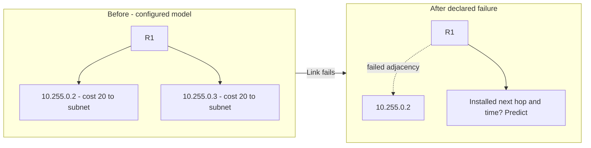

<!-- delivery:start c03.brief -->
# Pull One Link

**Module 1 · 40 minutes · Deliverable: `work/bootcamp/packet-path.md`**

Router R1 has two paths toward an application subnet. One link fails. Your
mission is to distinguish what the control plane learns, what the forwarding
table changes, and what still needs to happen for users to recover.

Prerequisite: prefix matching and next hops from Challenge 1. The
[reference card](reference.md) explains OSPF, BGP, ECMP, and VRFs.

The operations lead needs to know whether a routing change restored the
reporting service. Report measured forwarding progress separately from
unmeasured application recovery.
<!-- delivery:end c03.brief -->

<!-- delivery:start c03.predict -->
## Freeze and Predict — 5 Minutes

```sh
jq '.' labs/fixtures/routing/ospf.json
```

Draw the next-hop choices for `10.0.20.0/24`. The link to `10.255.0.2` now
fails. Before opening the event log, predict what information must change and
whether existing sessions necessarily survive. These are modeled router
snapshots, not the forwarding table used to build the foundations capture.

### One Failed Adjacency

Modeled R1 next-hop relationships from ospf.json, not physical cable
inventory. The failure condition is declared; the resulting table is a
prediction.



<!-- diagram: routing-predict -->
<details>
<summary>Editable Mermaid source</summary>



</details>

Text equivalent: The normal model has two cost-20 choices for 10.0.20.0/24.
The adjacency to 10.255.0.2 fails. Predict what installs next and what still
needs an application observation.

<!-- delivery:end c03.predict -->

<!-- delivery:start c03.reconstruct -->
## Reconstruct the Transition — 15 Minutes

```sh
jq -c '.' labs/fixtures/routing/route-events.jsonl
```

Fill the sheet's normal, detected-failure, table-update, and later-flow rows.
Calculate elapsed milliseconds from the first event. Identify the difference
between advertising a change and installing the remaining forwarding choice.

Do the timestamps measure packet loss, detection delay before the first log,
TCP recovery, or an application's first successful response? Choose one
additional observation to measure service recovery. Trace what an asymmetric
return path could mean for a stateful firewall.
<!-- delivery:end c03.reconstruct -->

<!-- delivery:start c03.compare -->
## Compare Policy and Context — 10 Minutes

```sh
jq '.' labs/fixtures/routing/bgp.json
jq '.' labs/fixtures/routing/vrfs.json
```

Among the two accepted BGP advertisements for `198.51.100.0/24`, choose the
preferred peer using the supplied attributes. Explain why the shorter AS path
does not decide this example. Does the rejected advertisement for another
prefix establish installed reachability?

Now look up `198.51.100.77` in CORP and OT. The same device can hold both
tables. Explain why its physical presence does not merge their routes, and
why a route would still not prove policy permission or a valid return path.
<!-- delivery:end c03.compare -->

<!-- delivery:start c03.review -->
## Debrief and Checkpoint — 10 Minutes

Each learner explains one transition without using “the network converged” as
the whole explanation. State the time interval you actually measured, a BGP
choice, a VRF distinction, and one unmeasured service condition.

Pass when the sheet distinguishes control-plane, forwarding, and application
claims. Use [hints](hints.md#challenge-3) or the
[worked review](../facilitator/solutions.md#challenge-3) afterward.

Next after lunch: [Spend Your Resilience Budget](04-resilience-budget.md).
<!-- delivery:end c03.review -->
