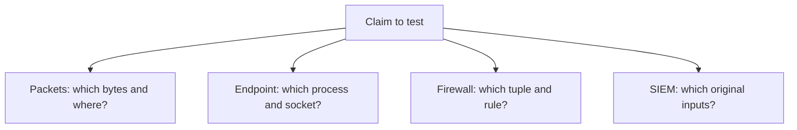

<!-- delivery:start c05.brief -->
# Suspicious Is Not Proven

**Module 3 · 65 minutes · Deliverable: `work/bootcamp/incident.md` and its CSV**

An alert names `ws-23`. Your mission is to explain what is known, what remains
possible, and what to do next. This is the original incident, separate from
the outage drills. Keep your path sheet and boundary map nearby.

Prerequisite: distinguish routes, policy, and observations. Use the
[evidence vocabulary](reference.md#services-and-evidence) if needed.

The security lead needs a defensible scope before containment. The OT
process owner maintains supervisory alarm visibility during packaging;
action that could interrupt that dependency needs that owner's decision.
Do not assume the suspicious workstation controls the production line.
<!-- delivery:end c05.brief -->

<!-- delivery:start c05.predict -->
## Brief and Predict — 5 Minutes

Before inspecting logs, predict where you could observe workstation traffic to
an external service and to an enterprise server. A SIEM alert is a lead, not a
confirmed incident. Do not begin with an assumed attack progression.

Read each round only after recording the preceding decision. Everyone receives
all three rounds. In pairs, rotate the evidence reader and skeptical reviewer;
alone, write the competing explanation before proceeding. All commands run
from the repository root.

### Which Source Can Test the Claim?

Conceptual evidence-choice map before the investigation reveal. Arrows mean a
question to ask, not independent corroboration.



<!-- diagram: evidence-predict -->
<details>
<summary>Editable Mermaid source</summary>



</details>

Text equivalent: Select the source for the claim: packet fields, process
attribution, rule decision, or alert inputs. Predict the evidence that would
change your confidence before opening it.

<!-- delivery:end c05.predict -->

<!-- delivery:start c05.round1 -->
## Round 1 — 12 Minutes

```sh
jq '.' labs/fixtures/challenges/incident-round-1.json
```

Identify the alert's original sources, the host, repeated destinations, ports,
timing, and volume. Does this establish malicious C2, successful access, or
only a pattern? Write a provisional claim and rank two next evidence sources,
explaining how their possible results would change your conclusion.

The JSON keys preserve source filenames. Rows in later rounds are not
additional independent observations of these same source files.
<!-- delivery:end c05.round1 -->

<!-- delivery:start c05.round2 -->
## Round 2 — 12 Minutes

```sh
jq '.' labs/fixtures/challenges/incident-round-2.json
```

Correlate host, account, process, DNS query, and source address. What directly
connects a process to a DNS query? What still fails to connect it to a socket?
Does successful authentication establish theft of credentials or execution
on the remote server?

Normalize the alternate display `2026-08-15T10:04:01-06:00` to UTC and find the
matching authentication record. This is a second display of that timestamp,
not another sensor event. Equal timestamps do not prove causal order; the
original incident supplies no measured clock-error bound.
<!-- delivery:end c05.round2 -->

<!-- delivery:start c05.round3 -->
## Round 3 — 12 Minutes

```sh
jq '.' labs/fixtures/challenges/incident-round-3.json
column -s, -t labs/fixtures/architecture/traffic-flows.csv
```

Compare intended permission with the actual recorded rule. Map the original
workstation address to the translated address. What does the proxy record add,
and what does it leave unproven about the destination's behavior?

Reconcile this handoff statement: “An external flow was observed, but OT has no
default route.” Is the observed source in OT? What does a denied direct OT
attempt say about scope, and what does it fail to establish about other paths?
<!-- delivery:end c05.round3 -->

<!-- delivery:start c05.narrative -->
## Assemble the Narrative — 14 Minutes

Choose six to eight decisive records for the existing ten-field ledger. Use
stable references such as `incident/firewall.jsonl`, record 1, session
`fw-9001`. Identify source collection points when known; write unknown when
not supplied. Do not invent sensor coverage, retention, or independent clocks.

Build a selected timeline, two plausible explanations, confidence per claim,
and a next evidence request. Write a narrative of at most 150 words.

For automatic reference checks, use IDs such as `incident/firewall.jsonl#1`
with source `incident/firewall.jsonl`. The suffix is the original record number,
starting at 1. Preserve the record's exact raw timestamp and supply its UTC
equivalent. Put the narrative inside the template's narrative markers. These
checks validate structure and references; the rubric evaluates your claims.

For a packet/log comparison, inspect a few selected records:

```sh
tshark -n -r labs/fixtures/pcaps/incident.pcap -Y 'dns || tls.handshake.type == 1' -T fields -E header=y -e frame.number -e ip.src -e ip.dst -e dns.qry.name -e tls.handshake.extensions_server_name
```

A ClientHello does not show a completed TLS session or application content.
Zeek output derived from this PCAP is another interpretation of the same
packets, not an independent sensor. A SIEM alert derived from flow and endpoint
events is also not another independent confirmation. The reference guides
provide the longer Zeek exercise after the one-day course.
<!-- delivery:end c05.narrative -->

<!-- delivery:start c05.review -->
## Debrief and Checkpoint — 10 Minutes

Choose a proportionate next action with an owner, operational effect,
validation, and rollback. Name the evidence you would preserve first. Avoid
disrupting shared OT services or disabling an account merely because the case
mentions them. This is a tabletop recommendation, not a live containment task.

Pass when another analyst can reproduce your strongest claim and identify its
limits. A defensible unresolved conclusion earns credit. After your attempt,
use [hints](hints.md#challenge-5), the
[worked review](../facilitator/solutions.md#challenge-5), and `./course timeline`
to compare your selected timeline with the full merged view.

Next after the break: [The Shift Handoff](06-the-shift-handoff.md).
<!-- delivery:end c05.review -->
