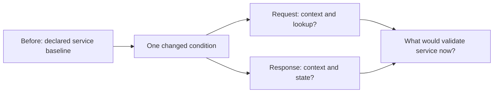

<!-- delivery:start c06.brief -->
# The Shift Handoff

> Integrated capstone · 55 minutes, then a 15-minute individual exit block

A fresh service problem arrives before the next shift. Use your three
deliverables to analyze it without a prescribed sequence of commands.
Prerequisite: complete Challenges 1–5, with hints and revisions as needed.

The incoming operator must make the next check without reconstructing your
reasoning from scratch. Name the service, deciding record, owner, and an
observable success condition.
<!-- delivery:end c06.brief -->

<!-- delivery:start c06.receive -->
## Receive the Case — 5 Minutes

Choose **A** for the team capstone; reserve **B** for the individual exit task.
A facilitator may reverse them, but do not read the reserved case early.

Record two possible mechanisms, your confidence (low/medium/high), and the
next evidence you want: state, observations, or conditions. In guided delivery,
use `diagnose` before any diagnostic views are released. For manual delivery,
start with this symptom: an approved health check previously succeeded and now
times out. Do not open the case packet until you record the initial diagnosis.

Case packets are small independent drills dated the following day, not extra
events in the original incident. Their explicit conditions replace relevant
reference assumptions for that drill only. Route snapshots are complete for
the specified flow; that does not assert global knowledge of the network.

### Trace the Changed Condition

Generic method for the assigned case, with no A/B solution values. Arrows
connect reasoning stages, not observed packet paths.

<!-- diagram: handoff-predict -->

Editable Mermaid source

Text equivalent: Name the prior baseline, the changed condition, independent
request and response decisions, and the service observation needed afterward.
Fill from the assigned case only.

<!-- delivery:end c06.receive -->

<!-- delivery:start c06.analyze -->
## Analyze — 20 Minutes

Request the case's state, observations, and conditions in your chosen order.
State what changed in your diagnosis after each view. In manual delivery, use
`jq '{before, after, routes, flow}'`, `jq '{observations}'`, and
`jq '{conditions, limitations, path, scope}'` with the assigned case file.
Preserve the template's stable artifact markers; headings may be renamed.
The assigned case ID is already recorded by the runner, so put the reasoning
in the marked sections rather than repeating a separate case-ID field.
Update each deliverable:

- **Engineering:** Trace forward and return decisions. Name the specific
  change, table, and observation that explain the behavior.
- **Architecture:** Mark the affected boundary and service. Distinguish the
  changed dependency from services that the case does not show failing.
- **Security:** Separate stated permission from actual enforcement. Determine
  whether a deny, translation, or missing forwarding decision is evidenced.
- **Response:** State the supported mechanism, uncertainty about intent or
  scope, best next action, and owner.

In pairs, each learner covers two viewpoints, then swaps explanations. Alone,
write one sentence from each viewpoint. Use case-specific observation IDs in
the ledger; do not merge the drill with the earlier incident timeline.
Use the observation's supplied ID as `evidence_id` and the assigned case's
exact filename as `source`. Keep six to eight original incident rows and
append the assigned case's rows.
<!-- delivery:end c06.analyze -->

<!-- delivery:start c06.handoff -->
## Prepare the Handoff — 10 Minutes

Give the next shift an observation, impact, evidence, confidence, and next
step. Include the relevant return path, an alternative explanation or unknown,
validation, and rollback. Record the handoff inside the incident template's
handoff markers in at most 150 words. Present it in under two minutes or share
the written version.
<!-- delivery:end c06.handoff -->

<!-- delivery:start c06.exchange -->
## Exchange and Challenge — 10 Minutes

Pairs exchange simultaneously. The recipient must state the next check in
their own words and identify an unsupported claim or missing qualification.
Solo learners compare against the [rubric](../facilitator/README.md#assessment)
before opening the relevant [solution](../facilitator/solutions.md#challenge-6).
<!-- delivery:end c06.exchange -->

<!-- delivery:start c06.review -->
## Debrief — 10 Minutes

Score mechanism, evidence, uncertainty, and action/handoff from 0–2. Revise
one weak dimension. This review passes at 6/8 with no zero after feedback.
Complete the individual exit, then check all remaining requirements in the
[completion policy](../agenda.md#completion-and-feedback). Multiple
proportionate actions may satisfy the rubric.
Useful [hints](hints.md#challenge-6) remain available; seek a fresh reassessment
after answer-bearing help.
<!-- delivery:end c06.review -->

<!-- delivery:start exit.answer -->
## Individual Exit — 5 Minutes

Work alone for the first five minutes on the reserved case:

Record an initial diagnosis with two hypotheses, confidence, and next evidence
before opening the reserved case. Guided delivery uses the `diagnose` action.
Then request state, observations, and conditions in your chosen order.

In four sentences, state the changed path, cite a decisive record, say what
does not follow from it, and choose the next action. If your group used B,
use A instead.
<!-- delivery:end exit.answer -->

<!-- delivery:start exit.review -->
## Exit Review and Revision — 5 Minutes

Compare your four sentences with the rubric and the relevant worked solution.
Revise one weak dimension, then record your individual review.
<!-- delivery:end exit.review -->

<!-- delivery:start exit.feedback -->
## Feedback — 5 Minutes

Rate 1–5: “I wanted to find out what happened next” and “The challenge felt
manageable.” Name one activity that dragged and one place needing more
explanation. Facilitators record timing and results on the
[pilot worksheet](../facilitator/pilot.md).

You have reached the end of the required path. Review unfinished work and your
rubric results before claiming completion. The [extensions](extensions.md) and
[reference library](../modules/README.md) are optional next steps.
<!-- delivery:end exit.feedback -->
