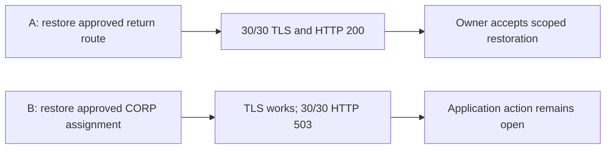
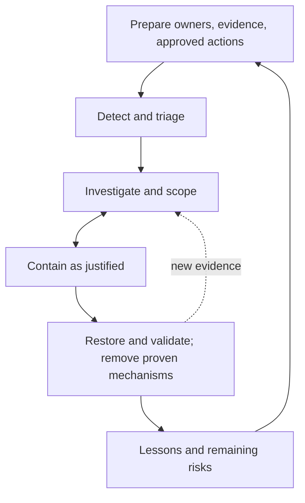

# After the Handoff: Did the Service Recover?

Open after both the main case and the independent exit are committed and
reviewed. This optional ten-minute epilogue can replace repeated verbal
recap in a facilitated debrief. It does not change either assessed answer.

```sh
jq '.' labs/fixtures/challenges/recovery.json
```

These are new hypothetical continuations of A and B. The original cases
still contain no post-repair observations; do not insert these into the
original incident ledger or use them to justify an earlier answer.

| Continuation | Change | Service observation | Closure decision |
| --- | --- | --- | --- |
| A, RA1–RA4 | Approved restoration of the removed return route | Client/server logs agree on 30/30 TLS and HTTP 200 checks in the stated window | Service owner accepts the scoped restoration; cause of the earlier change and other services remain unverified |
| B, RB1–RB4 | Approved restoration of CORP after the owner confirms accidental reassignment | TCP/TLS complete, but 30/30 HTTP 503 responses and backend-unavailable logs remain | Route repair accepted; service recovery not accepted; application owner investigates the backend |

Before opening the table, predict whether “route restored” is enough to
close either action. After reading, cite the change record, observation
point, monitoring window, owner acceptance, and residual risk. Append those
closure criteria to the existing `c06-handoff` region. An edited region
needs a current review if it is resubmitted through guided delivery.

Containment limits ongoing harm; restoration returns a service; eradication
removes a demonstrated malicious mechanism; prevention reduces recurrence.
A and B's repairs demonstrate neither compromise nor eradication. A short
healthy window also does not prove lasting availability of every service.

## A Repair Is Followed by a Service Test

Hypothetical recovery continuations RA1–RA4 and RB1–RB4, separate from
assessed pre-repair evidence. Arrows show change-to-validation sequence.


<!-- diagram: recovery -->
<details>
<summary>Editable Mermaid source</summary>



</details>

Text equivalent: A has a matching successful health-check window and owner
acceptance. B has transport and TLS progress but HTTP 503 responses, so
service recovery remains open. Both retain stated residual risks.

## Preserve the Evidence Before Changing the System

Example: an analyst receives a source capture and records its collection
time, interface, tool/options, collector, transfer, and known gaps. They
hash the received original, preserve it read-only, and analyze a separate
copy. A later hash comparison detects changes to those received bytes.
It does not prove that the source sensor captured every packet, had the
correct clock, or was trustworthy. A filtered copy needs a parent hash,
filter command, output hash, and frame mapping; its new frame 1 is not
automatically the original frame 1.

The course fixture and exemplar manifests check distribution integrity.
Collection provenance and real-world authenticity require separate evidence.
See [NIST SP 800-86 §3](https://csrc.nist.gov/pubs/sp/800/86/final),
reviewed September 14, 2026.

### Response Can Revisit Earlier Decisions

Conceptual teaching loop mapped to NIST SP 800-61r3. This is not an official
fixed sequence or a claim about actions already taken.



<!-- diagram: response-loop -->
<details>
<summary>Editable Mermaid source</summary>



</details>

Text equivalent: Prepare before detection. Investigation and containment can
overlap. Validate restoration, remove demonstrated malicious mechanisms when
applicable, and feed lessons into readiness; new evidence can reopen scope.

## Preparation and Feedback

Preparation includes owners, approved actions, inventories, recoverable
configuration, telemetry, and practice. Detection, investigation, scoping,
and containment can overlap and revisit earlier assumptions. Recovery
observations feed better monitoring and change procedures.

| Course activity | Relationship to NIST SP 800-61 Rev. 3 |
| --- | --- |
| Prepare owners, evidence, and safe actions | Govern, Identify, and Protect support readiness |
| Detect and triage a lead | Detect and Respond activities |
| Investigate, scope, contain, and remove demonstrated mechanisms | Respond activities; analysis and mitigation can overlap |
| Restore and validate service | Recover activities with communication and monitoring |
| Apply lessons to future readiness | Continuous improvement across risk management |

This is a teaching map, not an official NIST eight-step lifecycle.
[NIST SP 800-61 Rev. 3](https://csrc.nist.gov/pubs/sp/800/61/r3/final)
integrates incident response with CSF 2.0 risk management. Reviewed
September 14, 2026.
