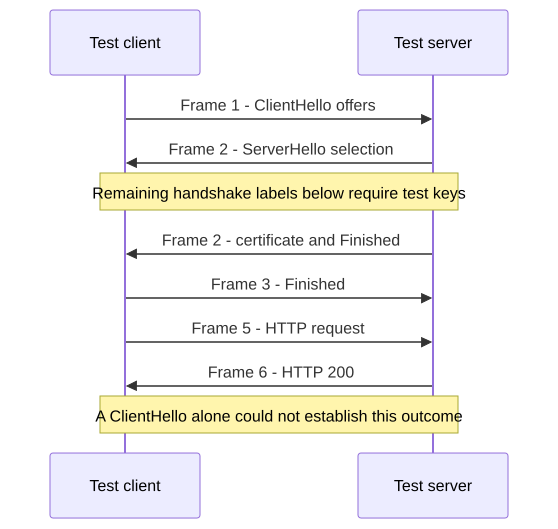
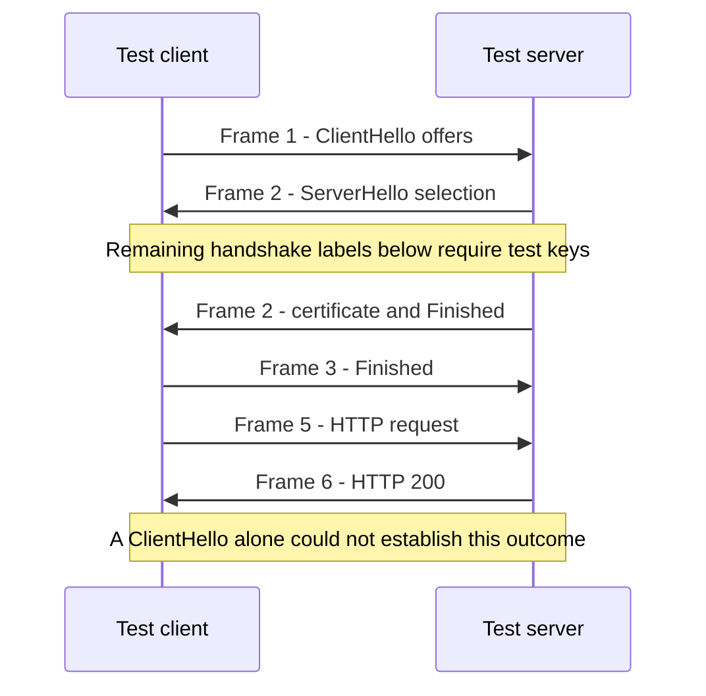

# Public Packet Exemplars

These independent Wireshark regression samples supplement the generated
factory exercises. They are optional extended study, not A/B assessment
evidence. Historical addresses and names are data to read locally; none of
the commands contacts them. Run commands from the course root with TShark.

## DNS Is One Dependency — 10 Minutes

Prerequisite: read a DNS query/answer and distinguish it from reachability.
Predict whether a successful answer guarantees an ICMP reply. Inspect:

```sh
tshark -n -r labs/exemplars/dns+icmp.pcapng.gz -Y 'frame.number >= 24 && frame.number <= 29' -T fields -E header=y -e frame.number -e ip.src -e ip.dst -e dns.qry.name -e dns.flags.rcode -e dns.a -e icmp.type
```

Frames 24–25 and 26–27 are query/answer pairs for `www.wireshark.org`;
responses have RCODE 0 and an A address. Frames 28–29 separately show ICMP
echo request/reply. Record two claims with separate frame citations: name
resolution and that echo exchange. Neither proves HTTP, TLS, or a later
service outcome. This file does not demonstrate NXDOMAIN or DNS timeout;
use the saved troubleshooting comparisons for those contrasts.

Observation point: the original tap placement is undocumented. The capture
contains Ethernet/IP DNS and ICMP, including historical real addresses and
other lookups. Do not infer whole-path visibility or loss from an omitted
reply. All 33 original frames remain; the filter selects six for the lesson.

## ClientHello Versus Completed TLS — 15 Minutes

Prerequisites: TCP versus application evidence; TLS handshake vocabulary.
The first five minutes can replace a repeated TLS reference discussion.
Predict which facts change when the matching **public test key log** is
supplied. These keys apply only to this deliberately captured TLS 1.3 test.

```sh
tshark -n -r labs/exemplars/tls13-rfc8446.pcap -Y 'frame.number <= 6' -T fields -E header=y -e frame.number -e tls.handshake.type -e tls.record.content_type -e http.response.code
tshark -n -r labs/exemplars/tls13-rfc8446.pcap -o tls.keylog_file:labs/exemplars/tls13-rfc8446.keys -Y 'frame.number <= 6' -T fields -E header=y -e frame.number -e tls.handshake.type -e http.request.uri -e http.response.code
```

| Frames | Keyless observation | With the supplied keys |
| --- | --- | --- |
| 1 | ClientHello: offers | Same offer; not yet a negotiated session |
| 2 | ServerHello and encrypted records | ServerHello, EncryptedExtensions, Certificate, CertificateVerify, Finished |
| 3 | Encrypted record | Client Finished |
| 5–6 | Encrypted records | HTTP request `/first` and response 200 |

Handshake type 20 is Finished; 11 is Certificate. Type 2 is ServerHello.
TLS 1.3 outer ApplicationData records can contain encrypted handshake
messages: the outer type alone does not prove application bytes. Contrast
the factory incident's ClientHello-only observations with this stronger,
key-assisted evidence. An HTTP 200 is a protocol response, not proof of a
correct business transaction. The initial TCP handshake is absent here.

Optional resumption comparison: frames 7–13 show a resumed exchange and
early data. The second handshake need not repeat a certificate; PSK-based
authentication is different from a fresh certificate exchange. Early data
also has replay considerations. Complete the task with one supported claim,
one previously invisible field, and one remaining uncertainty.

Observation point: upstream describes a BoringSSL-generated test; precise
tap placement is unspecified. It uses test endpoints and short test requests.
All 13 original frames and the original companion key log are preserved.

### What the Public Test Keys Reveal

tls13-rfc8446.pcap, selected original frames. Arrows represent captured
exchanges; Finished and HTTP labels require the supplied public test keys.
Initial TCP establishment is outside this capture.



<!-- diagram: public-tls -->
<details>
<summary>Editable Mermaid source</summary>



</details>

Text equivalent: Without the key log, distinguish offers and the visible
ServerHello from encrypted records. With the matching keys, frame 2 includes
the server Finished, frame 3 the client Finished, and frames 5–6 the HTTP
exchange. This is stronger than a ClientHello-only claim.

## QUIC and HTTP/3 — 15 Minutes

Prerequisites: TLS visibility and transport versus application protocols.
Predict why UDP traffic can still carry reliable application streams.

```sh
tshark -n -r labs/exemplars/quic-with-secrets.pcapng -Y 'frame.number == 4 || frame.number == 12 || frame.number == 47 || frame.number == 49 || frame.number == 51 || frame.number == 53 || frame.number == 55 || frame.number == 62' -T fields -E header=y -e frame.number -e tcp.srcport -e udp.srcport -e quic.version -e tls.handshake.type -e http2.headers.method -e http3.headers.method -e http3.headers.status
```

The original 83-frame file first contains TCP/TLS/HTTP2, then QUIC version 1
from frame 47. Frames 49, 51, and 53 contain handshake progress, frame 55 an
HTTP/3 GET, and frame 62 status 200. Explain which transport fields differ
and why application delivery guarantees cannot be inferred from UDP alone.
QUIC supplies streams, loss recovery, congestion control, and TLS security.

**Visibility condition:** this PCAPNG embeds one decryption-secrets block.
TShark uses those provided secrets to show the later handshake and HTTP/3.
This is not ordinary passive access to arbitrary QUIC application content.
The initial QUIC packet protection has different key derivation from later
traffic; do not generalize readable Initial metadata to all packet contents.

Observation point: interface metadata says `eth0`; physical placement is
unknown. The file retains a TraceWrangler sanitization comment, OS metadata,
historical endpoint addresses, and `cloudflare-quic.com` requests for `/`.
These were inspected with decoded HTTP headers and capture metadata. No
claim of complete anonymization is made. Original bytes are preserved.

## Acquisition, Terms, and Maintenance

[manifest.json](manifest.json) pins URLs, source revision, introduction
commits, contributors, retrieval date, byte counts, original hashes, formats,
packet counts, companions, and executable frame assertions. The three
captures total under 51 KB including compressed DNS. There are no excerpts
or transformations; displayed frame numbers equal upstream frame numbers.

These files were introduced as Wireshark test-suite assets by Peter Wu
(TLS and key log), Gerald Combs (DNS), and Niels Widger (QUIC). The TLS
introduction explicitly describes BoringSSL-generated traffic. Introduction
commits are linked in the manifest. Review used those commits and their
test assertions, the pinned repository license, and the project's
[licensing statement](https://www.wireshark.org/faq.html#what-is-wireshark).
The redistribution basis is the Wireshark source distribution's GPL terms;
no separate per-capture license exception was found in these introductions.
This does not assign the repository license to unrelated wiki uploads.

Keep [the upstream GPL notice](COPYING.wireshark), this attribution, the
manifest, and the unmodified editable assets together when redistributing.
The key log is public test material, not a user's credential. The samples
are supplied without warranty under their upstream terms.

Normal checks are offline:

```sh
python3 -B labs/exemplars/manage.py --decode
```

Maintainer-only reacquisition uses `curl --fail --location` with HTTPS-only
redirects, a deadline, and a temporary directory. It verifies the complete
set before replacing any asset. Hashes are pinned in advance; a mismatch
stops import. Review source terms, payloads, metadata, secrets, assertions,
and lesson claims before intentionally changing a pin.

```sh
python3 -B labs/exemplars/manage.py --fetch --decode
```

Course startup never fetches. Packaging includes these files and a separate
exemplar fingerprint in `RELEASE.json`. If a future lesson makes them assessed
evidence, extend session fingerprints and support/exposure rules at that time.

Protocol references, reviewed September 14, 2026:
[RFC 8446 §§2, 4](https://www.rfc-editor.org/rfc/rfc8446.html),
[RFC 9000 §§2, 7](https://www.rfc-editor.org/rfc/rfc9000.html), and
[RFC 1035 §4](https://www.rfc-editor.org/rfc/rfc1035.html#section-4).
