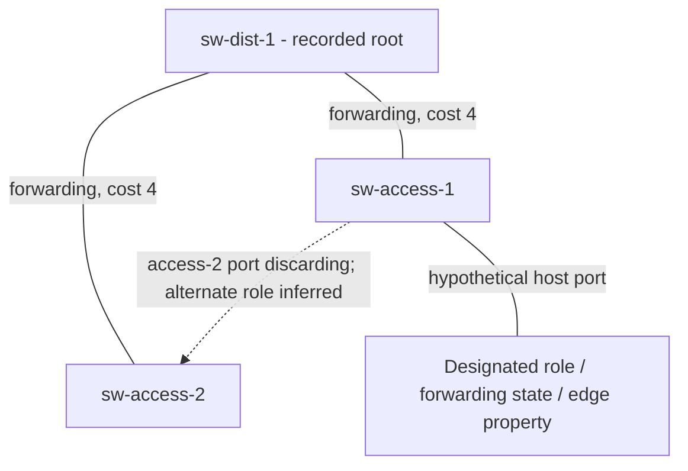

# Spanning Tree Protocol

> **Module 1 · Section 2**

## Why It Matters

Redundant Layer 2 links can create persistent loops because Ethernet has no hop
limit. Spanning Tree selects a loop-free active topology while retaining backup
links.

## Core Model

* STP elects a root bridge using bridge identifiers and calculates lowest-cost
  paths toward it.

* Port roles and states determine which links forward frames and which remain
  blocked to prevent loops.

* RSTP accelerates convergence by using improved roles and handshakes while
  preserving the loop-free objective.

* A topology change can move MAC addresses, cause temporary flooding, and alter
  the packet path.

* An unexpected root or inconsistent protection setting can enlarge failure
  domains even when connectivity appears normal.

## Reasoning Process

1. Identify the elected root and each switch's best path toward it.

2. Separate RSTP roles (root, designated, alternate, backup), states
   (discarding, learning, forwarding), and the edge property. A hypothetical
   host-facing port can be designated, forwarding, and edge at once. The
   saved switch-link model does not provide host-port edge configuration.

3. Remove non-forwarding links and verify that the remaining topology is
   loop-free.

4. Fail one active link and predict the new port roles, transient flooding, and
   affected flows.

### Roles, States, and Edge Property

network/l2-control.json provides the three-switch model. Labels distinguish
recorded state from a role inferred using the equal costs.



<!-- diagram: stp -->
<details>
<summary>Editable Mermaid source</summary>



</details>

Text equivalent: Both access switches reach the root directly. The inter-
access port on access-2 discards. Its alternate role is inferred; the separate
host port illustrates designated, forwarding, and edge together and is not
supplied device configuration.

## Teaching Instructions

Use the [shared extended-study workflow](../../README.md#learning-workflow).
This task defines the required observations for this guide. The reasoning
checklist above is a general method: when device state is not supplied,
record it as unknown or explain a stated hypothetical; do not invent it.

**Predict and explain:** Predict which triangle edge cannot forward at both
ends without a loop.

Run from the repository root:

```sh
jq '.stp' labs/fixtures/network/l2-control.json
```

## Expected Evidence and Worked Reasoning

The model names sw-dist-1 as root and the access-to-access edge as discarding
on access-2. A root-port role can be inferred from costs, but edge-port
configuration is not supplied.

## Completion Standard

Separate recorded state, inferred role, and unknown edge property.

Keep a prediction, the decisive citation or stated assumption, your revised
explanation, and one unresolved question in your existing module notes.
For optional separate notes, mirror this guide path under `work/`.
Knowledge checks below extend the conceptual model; unavailable device
state is a valid unknown, never a requirement to fabricate evidence.

## Check Your Understanding

1. Why are redundant Layer 2 links dangerous without a loop-prevention
   protocol?

2. What traffic effect can occur while switches relearn MAC locations?

3. How can the root bridge influence real traffic paths?

## Sources

Reviewed September 14, 2026. The exercise is self-contained and offline.
These references support the general model, not the fictional observations.

[Cisco — RSTP roles and states](https://www.cisco.com/c/en/us/support/docs/lan-switching/spanning-tree-protocol/24062-146.html)
