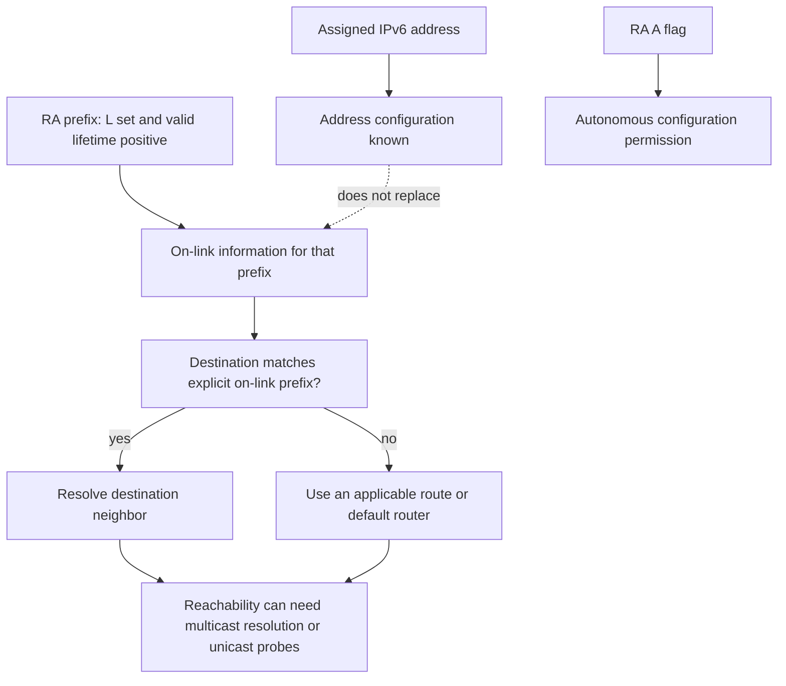

# IPv6 and Neighbor Discovery

> **Module 1 · Section 3**

## Why It Matters

IPv6 changes address size and local-neighbor mechanisms while preserving the
core routed-packet model. Conceptual familiarity prevents IPv4-only reasoning
from causing blind spots.

## Core Model

* IPv6 uses 128-bit addresses and prefix lengths; `/64` is the common size for
  a LAN segment.

* Link-local addresses in `fe80::/10` support neighbor and router communication
  even without a global address.

* Neighbor Discovery uses ICMPv6 instead of ARP. It includes multicast
  address-resolution exchanges and unicast neighbor-reachability probes.

* Router Advertisements can provide prefix and default-router information;
  DHCPv6 can supply additional configuration depending on design.

* IPv6 has no router-based packet fragmentation; endpoints rely on Path MTU
  Discovery and source fragmentation when needed.

## Reasoning Process

1. Classify each IPv6 address as loopback, link-local, unique-local, multicast,
   or global.

2. Consult explicit on-link information: the host prefix list, routes, or
   a valid RA Prefix Information Option with L set. An assigned address
   and matching address bits alone do not establish on-link status. The
   independent A flag permits autonomous address configuration.

3. Identify the Neighbor Solicitation, Neighbor Advertisement, and router
   information required.

4. Trace the packet while preserving scope identifiers for link-local
   addresses.

## Worked On-Link Decision

An interface address `2001:db8:10::23/64` alone does not establish that
`2001:db8:10::53` is on-link. With only that information, the result is
unknown. In this saved model, the RA explicitly sets `on_link: true` (L),
`autonomous: true` (A), and a positive `valid_lifetime` for the prefix;
at the snapshot time the host may resolve that destination directly.
The separate `router_lifetime` determines default-router validity. An
expired prefix or L unset cannot be replaced by a guess from address bits.

### Three Different IPv6 Questions

Decision model using network/ipv6.json RA fields. L means on-link; A means
autonomous address configuration. No ND packets are supplied.



<!-- diagram: ipv6 -->
<details>
<summary>Editable Mermaid source</summary>



</details>

Text equivalent: Address configuration, explicit on-link state, and neighbor
reachability are separate. The saved RA has L/A true and a positive prefix
lifetime; the default router has its own lifetime. Matching bits in an
assigned address alone are insufficient.

## Teaching Instructions

Use the [shared extended-study workflow](../../README.md#learning-workflow).
This task defines the required observations for this guide. The reasoning
checklist above is a general method: when device state is not supplied,
record it as unknown or explain a stated hypothetical; do not invent it.

**Predict and explain:** Predict the result if only the assigned /64 address
were available, then use the RA fields.

Run from the repository root:

```sh
jq '.' labs/fixtures/network/ipv6.json
```

## Expected Evidence and Worked Reasoning

Address bits alone are insufficient. The saved RA sets on_link and autonomous
true with valid_lifetime 3600; default_router is fe80::1%en0. STALE is not
proof of failure.

## Completion Standard

Distinguish address configuration, explicit on-link state, and reachability.

Keep a prediction, the decisive citation or stated assumption, your revised
explanation, and one unresolved question in your existing module notes.
For optional separate notes, mirror this guide path under `work/`.
Knowledge checks below extend the conceptual model; unavailable device
state is a valid unknown, never a requirement to fabricate evidence.

## Check Your Understanding

1. What function replaces ARP in IPv6?

2. Why does a link-local address sometimes require an interface scope?

3. Which endpoint is responsible for IPv6 fragmentation?

## Sources

Reviewed September 14, 2026. The exercise is self-contained and offline.
These references support the general model, not the fictional observations.

[RFC 5942 §3 — IPv6 subnet model](https://www.rfc-editor.org/rfc/rfc5942.html#section-3)

[RFC 4861 §§4.6.2, 7.3 — flags and reachability](https://www.rfc-editor.org/rfc/rfc4861.html)
