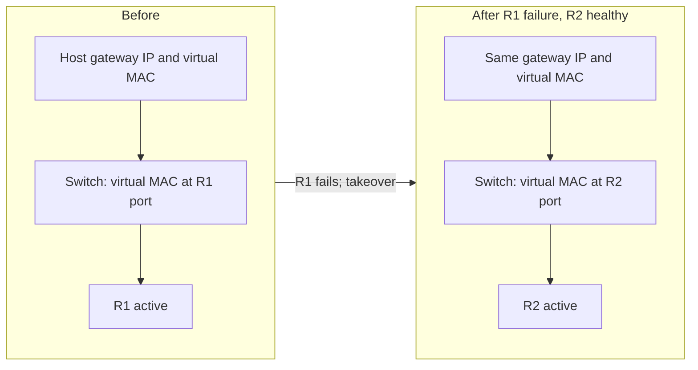

# First-Hop Redundancy, HSRP, and VRRP

> **Module 2 · Section 2**

## Why It Matters

First-hop redundancy allows hosts to use a stable default-gateway address while
multiple routers can provide forwarding.

## Core Model

* A virtual IP address and virtual MAC represent the default gateway presented
  to hosts.

* One device normally owns active forwarding responsibility for a group while a
  peer is prepared to take over.

* HSRP and VRRP differ in details but provide the same conceptual service:
  resilient first-hop ownership.

* Priority, preemption, object tracking, timers, and interface state influence
  which device becomes active.

* Gateway redundancy does not guarantee upstream routing, policy, or
  stateful-service redundancy.

## Worked Takeover

Assume ordinary VRRP virtual-MAC operation: the host keeps the same gateway
IP and virtual MAC when the backup takes over. Switch forwarding learns the
virtual MAC on the new active router port. The host need not replace it
with the new router's physical MAC. A mode using physical interface MACs
needs its own explicit assumptions. No FHRP state capture is supplied here.

## Reasoning Process

1. Identify the virtual gateway, physical peers, active owner, and tracked
   dependencies.

2. Trace normal traffic through the active device and verify the return path.

3. Fail the active device or tracked uplink and order ownership,
   neighbor-cache, and routing changes.

4. Check for state, policy, or asymmetric-path effects after takeover.

### Stable Gateway, New Forwarding Location

Conceptual ordinary virtual-MAC takeover; no FHRP capture or timer measurement
is supplied. Both panels represent the same host and virtual identity.

<!-- diagram: fhrp -->

Editable Mermaid source

Text equivalent: The gateway IP and virtual MAC stay stable. The switch
forwarding location moves to R2. This says nothing by itself about upstream
routes, firewall state, takeover duration, or application recovery.

## Teaching Instructions

Use the [shared extended-study workflow](../../README.md#learning-workflow).
This task defines the required observations for this guide. The reasoning
checklist above is a general method: when device state is not supplied,
record it as unknown or explain a stated hypothetical; do not invent it.

**Predict and explain:** Assume routers R1 and R2 share one virtual gateway,
R1 is active, and R1 fails while R2 has healthy upstream routing. Predict
stable identity and moved forwarding location.

This is a conceptual exercise under the assumptions above; no device
configuration or observed takeover/fabric state is supplied.

## Expected Evidence and Worked Reasoning

Ordinary virtual-MAC takeover preserves host gateway IP/MAC while the switch
learns the virtual MAC at R2. Tracking, exact timer, and application-state
behavior are unspecified.

## Completion Standard

Explain identity versus location without inventing measured failover time.

Keep a prediction, the decisive citation or stated assumption, your revised
explanation, and one unresolved question in your existing module notes.
For optional separate notes, mirror this guide path under `work/`.
Knowledge checks below extend the conceptual model; unavailable device
state is a valid unknown, never a requirement to fabricate evidence.

## Check Your Understanding

1. Why can a virtual gateway remain reachable while upstream connectivity is
   broken?

2. What does preemption change?

3. During ordinary virtual-gateway takeover, which identity stays stable
   and which switch forwarding location changes?

## Sources

Reviewed September 14, 2026. The exercise is self-contained and offline.
These references support the general model, not the fictional observations.

[RFC 9568 §8.1.2 — virtual-router MAC](https://www.rfc-editor.org/rfc/rfc9568.html#section-8.1.2)
