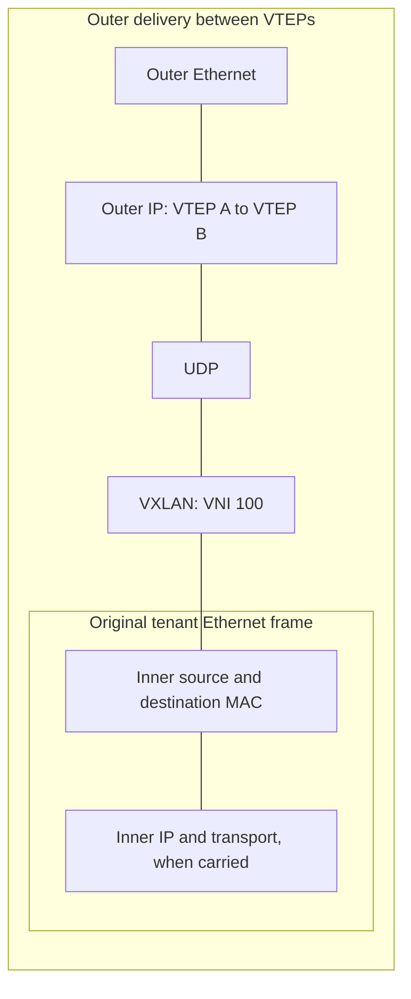

# Underlays, Overlays, VXLAN, and EVPN

> Module 2 · Section 5 · Optional conceptual reference

## Purpose

Explain why a fabric can have working IP transport but broken tenant
connectivity. In the one-day course, use this as a recognition topic in the
[pocket reference](../../../challenges/reference.md). No separate submission
is required.

## Core Model

* The underlay supplies IP reachability between tunnel endpoints.
* VXLAN carries an Ethernet frame in UDP/IP; the VNI identifies a logical
  segment. Inner IP traffic still travels inside that Ethernet frame.
* A VTEP adds or removes the encapsulation at a tunnel endpoint.
* EVPN uses BGP to distribute overlay reachability such as MAC/IP information.
* A healthy underlay does not establish correct overlay mappings, tenant
  policy, or sufficient MTU after encapsulation.

### Inner Identity, Outer Delivery

Conceptual VXLAN encapsulation between VTEPs; no encapsulated packet is
supplied. The boxes show nesting, not a measured byte budget.



<!-- diagram: vxlan -->
<details>
<summary>Editable Mermaid source</summary>



</details>

Text equivalent: VXLAN carries the original Ethernet frame inside UDP/IP and
an outer Ethernet frame. Underlay routing reaches VTEP B; overlay mappings
locate the inner destination. Added bytes need a separate MTU budget.

## Conceptual Exercise

Use this explicitly hypothetical diagram, not the cloud route fixture:

```text
Host A -- VTEP A ===== routed IP underlay ===== VTEP B -- Host B
           |                                      |
           +------------ logical VNI 100 ----------+
```

1. Label the original endpoints, outer tunnel endpoints, and the distinction
   between underlay forwarding and overlay mapping.
2. Predict a symptom if the underlay route works but the remote MAC mapping is
   missing. Name the table and packet evidence you would request.
3. Explain why added encapsulation introduces a packet-size constraint even
   when the unencapsulated traffic previously fit.
4. Distinguish the VXLAN data-plane encapsulation from EVPN control-plane
   distribution. A VNI alone does not prove tenant authorization.

## Evidence Boundary and Self-Check

The repository's cloud route tables do not contain VNIs, VTEP mappings, EVPN
routes, or VXLAN packets. They cannot substantiate an encapsulation walkthrough.
This exercise practices a mental model only. A future fabric lab would need
those artifacts and a separately budgeted activity.

A satisfactory explanation identifies two different reachability questions:
can the outer packet reach the remote VTEP, and does the overlay know where the
inner destination belongs? It also identifies MTU and policy as independent
constraints. Keep any optional notes in your architecture assessment.

## Teaching Instructions

Use the [shared extended-study workflow](../../README.md#learning-workflow).
This task defines the required observations for this guide. The reasoning
checklist above is a general method: when device state is not supplied,
record it as unknown or explain a stated hypothetical; do not invent it.

**Predict and explain:** Assume VTEP A/B share VNI 100 and the underlay
reaches both. Predict what a missing destination MAC mapping can prevent.

This is a conceptual exercise under the assumptions above; no device
configuration or observed takeover/fabric state is supplied.

## Expected Evidence and Worked Reasoning

Outer IP reachability does not establish inner destination mapping or policy.
VXLAN adds an outer Ethernet/IP/UDP/VXLAN wrapper; EVPN distributes
reachability. No VXLAN capture is supplied.

## Completion Standard

Distinguish outer transport, inner identity, mapping, and MTU.

Keep a prediction, the decisive citation or stated assumption, your revised
explanation, and one unresolved question in your existing module notes.
For optional separate notes, mirror this guide path under `work/`.
Knowledge checks below extend the conceptual model; unavailable device
state is a valid unknown, never a requirement to fabricate evidence.

## Sources

Reviewed September 14, 2026. The exercise is self-contained and offline.
These references support the general model, not the fictional observations.

[RFC 7348 §5 — VXLAN frame format](https://www.rfc-editor.org/rfc/rfc7348.html#section-5)

[RFC 7432 §§7, 9 — EVPN routes and learning](https://www.rfc-editor.org/rfc/rfc7432.html)
