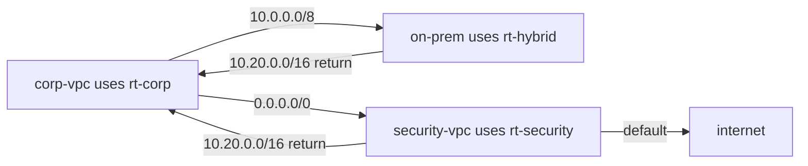

# Cloud Virtual Networks, Routes, and Controls

> **Module 2 · Section 5**

## Why It Matters

Cloud networks expose logical constructs through provider control planes. The
packet model still applies, but diagrams must include implicit routers,
distributed controls, and platform-owned dependencies.

## Core Model

* A virtual network contains address ranges, subnets, virtual interfaces, route
  tables, and gateways implemented by the provider.

* Subnet labels do not necessarily imply Layer 2 broadcast behavior like a
  physical VLAN.

* Route tables determine next targets such as local delivery, internet, NAT,
  firewall, peering, or transit.

* Security groups are commonly stateful interface-level controls; network ACLs
  are commonly stateless subnet-level controls, though semantics vary by
  provider.

* Public addresses, managed load balancers, private endpoints, and service
  networking create multiple identity and observation layers.

## Reasoning Process

1. Inventory virtual interfaces, addresses, subnets, route associations, and
   gateway targets.

2. Trace the effective route and every distributed or centralized policy.

3. Mark provider-managed translation, load balancing, and service endpoints.

4. Identify telemetry sources and facts the customer cannot directly observe.

### Attachment and Route Targets

architecture/cloud-routes.json is a logical route model. These arrows are
selected route targets, not physical fabric links or proof of inspection.



<!-- diagram: cloud -->
<details>
<summary>Editable Mermaid source</summary>



</details>

Text equivalent: rt-corp sends the on-premises /8 directly to on-prem and its
default toward security-vpc. rt-hybrid returns the cloud /16. The graph cannot
establish symmetric stateful inspection or a physical leaf/spine path.

## Teaching Instructions

Use the [shared extended-study workflow](../../README.md#learning-workflow).
This task defines the required observations for this guide. The reasoning
checklist above is a general method: when device state is not supplied,
record it as unknown or explain a stated hypothetical; do not invent it.

**Predict and explain:** Predict whether rt-corp's security default applies to
on-premises 10.0.20.40.

Run from the repository root:

```sh
jq '.' labs/fixtures/architecture/cloud-routes.json
```

## Expected Evidence and Worked Reasoning

Its matching 10.0.0.0/8 targets on-prem and wins over the security default.
Cloud subnet names do not prove Ethernet broadcast behavior.

## Completion Standard

Trace the selected target and identify the absent inspection-state evidence.

Keep a prediction, the decisive citation or stated assumption, your revised
explanation, and one unresolved question in your existing module notes.
For optional separate notes, mirror this guide path under `work/`.
Knowledge checks below extend the conceptual model; unavailable device
state is a valid unknown, never a requirement to fabricate evidence.

## Check Your Understanding

1. Why should a cloud subnet not be assumed to behave like an Ethernet VLAN?

2. How can stateful and stateless controls interact?

3. What part of a managed service path may remain outside customer visibility?

## Sources

Reviewed September 14, 2026. The exercise is self-contained and offline.
These references support the general model, not the fictional observations.

[AWS — transit route-table association and propagation](https://docs.aws.amazon.com/vpc/latest/tgw/tgw-route-tables.html)
